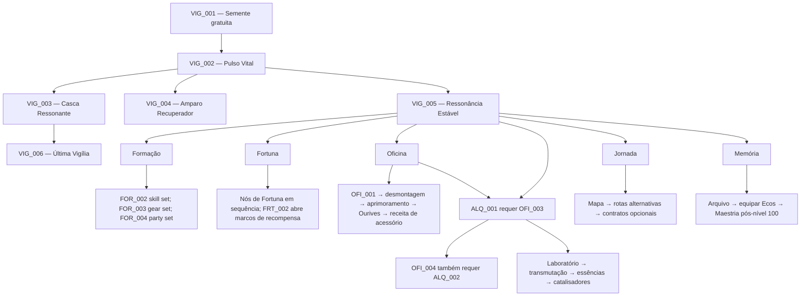

# Árvore Global de Ressonância

> **Fonte e escopo:** Esta é uma transcrição estruturada da proposta v0.1, atualizada pelas decisões de fundação abaixo. Não adiciona dados runtime. A palavra MVP no original significa protótipo do sistema, não o MVP do Pocket Hero.
> **Documento original:** [2-Taskbar_Arvore_Global_de_Ressonancia_v0.1.docx](../../documents/2-Taskbar_Arvore_Global_de_Ressonancia_v0.1.docx). A conversão preserva texto e tabelas; elementos visuais do Word, se houver, continuam disponíveis apenas no DOCX.

## Decisões de base aprovadas por delegação de Rafael

- **DECIDIDO em 2026-09-28:** a Árvore dos Ecos é progressão global persistente da conta/Hub, compartilhada pelos oito heróis e separada das árvores individuais de herói e das escolhas temporárias da expedição.
- **DECIDIDO em 2026-09-28:** seu papel primário é abrir sistemas, escolhas e conveniência; bônus numéricos são complementares. Restaurar/desbloquear um serviço uma vez é permanente e não pode ser desfeito por respec.
- **DECIDIDO em 2026-09-28:** o primeiro escopo contém **30 nós**, distribuídos conforme o catálogo abaixo: Vigília 6, Formação 5, Fortuna 4, Oficina 5, Alquimia 4, Jornada 3 e Memória 3. Valores runtime continuam fora deste documento.
- **DECIDIDO em 2026-09-28:** usar Fragmentos de Ressonância como recurso separado do ouro: fontes principais são primeira vitória e marcos/objetivos de campanha; repetição de conteúdo não deve ser o melhor método de farm. A economia define valores e retorno decrescente em `ECON-1`.
- **DECIDIDO em 2026-09-28:** respec no Hub pode devolver investimentos de nós numéricos e efeitos reversíveis; desbloqueios de sistemas/serviços/conteúdo permanecem. Custo e limites ficam para `ECON-1`.

Estas decisões fecham o propósito e os limites do sistema. O catálogo de 30 nós abaixo fecha o escopo e os efeitos qualitativos; custos absolutos, efeitos quantitativos, UI detalhada e runtime continuam em aberto.

## Como usar esta proposta no Pocket Hero

- A árvore é o sistema de meta-progressão compartilhada aprovado para design, integrado ao Refúgio da Vigília.
- “Árvore dos Ecos” é o nome diegético adotado; “Árvore Global de Ressonância” é o nome técnico. Fragmentos de Ressonância são o recurso de design aprovado, ainda sem valor/runtime.
- O escopo de design inicial é de 30 nós em sete ramos; catálogo, pré-requisitos e efeitos qualitativos foram aprovados em `TREE-1`. Custos absolutos e valores quantitativos ficam para `ECON-1`/`BALANCE-1`.
- “Prototype”, “MVP” e “Launch” nas tabelas da fonte são fases do próprio sistema candidato; não reabrem nem redefinem o MVP já homologado do Pocket Hero.
- As listas de serviços nos ramos da proposta original descrevem possibilidades de longo prazo. O catálogo TREE-1 abaixo e a sequência CRAFT-1 em [Equipamentos e artesãos](EQUIPMENT_AND_CRAFTING_SYSTEM.md) determinam o escopo inicial vigente.

**PROJETO TASKBAR**

# ÁRVORE GLOBAL DE RESSONÂNCIA

**Progressão permanente da cidade e da conta**

| Status | DESIGN PROPOSAL |
| --- | --- |
| Versão | v0.1 |
| Escopo | Sistema global / Hub / progressão |
| Uso | Documento-base para implementação e balanceamento |

**Documento de design — referência canônica**

## 1. Visão do sistema

A Árvore Global de Ressonância é a progressão permanente compartilhada por todos os heróis. Ela cumpre o papel que uma Rune Tree cumpre em um idle/RPG, mas é integrada à nossa cidade e à lore: o jogador não abre um menu abstrato de runas; ele restaura uma estrutura viva de Lúmen no centro do Hub.

> Nome canônico proposto
> ÁRVORE DOS ECOS — nome diegético. “Árvore Global de Ressonância” é o nome técnico usado nos documentos de design. A árvore cresce fisicamente na cidade conforme o jogador progride.

Ela deve resolver quatro necessidades ao mesmo tempo: dar objetivos de longo prazo, desbloquear sistemas aos poucos, fazer todos os heróis se beneficiarem do progresso da conta e transformar a cidade em algo que evolui visualmente com o jogador.

## 2. O que ela NÃO é

- Não é uma segunda árvore de talentos individual de cada herói.
- Não deve existir apenas para acumular +1% de dano repetidas vezes.
- Não deve obrigar o jogador a seguir uma única rota “correta”.
- Não substitui equipamentos, Maestria, Traits ou níveis de herói.
- Não deve exigir reiniciar o personagem para ter valor.

> Regra de ouro
> Os melhores nós desbloqueiam possibilidades, conveniência e novas interações. Bônus numéricos existem, mas servem para conectar marcos maiores.

## 3. Integração com a cidade

No Hub existe uma árvore petrificada ou estrutura orgânica de Lúmen chamada Árvore dos Ecos. No começo ela está quase apagada. Fragmentos recuperados durante as expedições devolvem vida aos seus galhos.

> EXPEDIÇÃO

- Novos ramos surgem visualmente na praça central.
- NPCs comentam marcos importantes.
- Certos nós restauram prédios ou serviços da cidade.
- Grandes Keystones alteram iluminação, partículas ou arquitetura do Hub.
- O jogador consegue “ver” seu progresso permanente sem abrir menus.
## 4. Moeda principal

## Fragmentos de Ressonância

Moeda exclusiva da Árvore dos Ecos. É obtida principalmente ao vencer conteúdo pela primeira vez e ao completar objetivos relevantes, evitando que o melhor método seja repetir infinitamente a fase mais fácil.

| Fonte | Uso recomendado | Observação |
| --- | --- | --- |
| Primeira conclusão de estágio | Alta | Principal motor inicial |
| Chefes | Alta | Bônus na primeira vitória e pequena recompensa recorrente |
| Missões do Hub | Média | Conecta sistemas da cidade |
| Desafios de herói | Média | Estimula experimentar o roster |
| Eventos / marcos de campanha | Alta | Nós narrativos e expansões |
| Conteúdo repetido | Baixa | Existe, mas com retorno decrescente |

Ouro não compra diretamente os nós principais. Isso evita que farm econômico e progressão estrutural virem o mesmo recurso.

## 5. Tipos de nó

| Tipo | Função | Exemplo |
| --- | --- | --- |
| Menor | Pequeno bônus permanente | +2% vida base de todos os heróis |
| Maior | Bônus relevante / nova regra | Primeiro item raro do dia tem proteção contra atributo inútil |
| Desbloqueio | Abre sistema | Segundo slot de Skill ativa |
| Cidade | Restaura serviço/NPC | Ferreiro aprende Reforja |
| Escolha | Duas opções mutuamente exclusivas até respec | Mais loot ou mais materiais |
| Keystone | Muda a progressão | Libera terceiro herói na formação |
| Memória | Lore + recompensa | Cena, Codex e Echo especial |

## 6. Estrutura recomendada no lançamento

Em vez de começar com quase duzentos nós, o projeto deve crescer em camadas. Isso reduz custo de balanceamento e evita uma árvore enorme antes de os sistemas do jogo estarem maduros.

| Fase | Nós | Objetivo |
| --- | --- | --- |
| Prototype | 24–30 | Validar progressão e UI |
| Early Access / Alpha | 48–60 | Conectar cidade, formação e loot |
| Launch | 72–90 | Árvore completa com escolhas reais |
| Expansões | +12 a +24 por grande atualização | Adicionar conteúdo sem invalidar o antigo |

> Recomendação
> Meta de lançamento: aproximadamente 84 nós. É grande o bastante para dar profundidade, mas ainda auditável e balanceável.

## 7. Os sete ramos

| Ramo | Tema | Entrega principal |
| --- | --- | --- |
| RAIZ DA VIGÍLIA | Fundação | Vida, resistência, cura básica, recuperação, segurança de progressão. |
| RAMO DA FORMAÇÃO | Equipe | Slots de herói, segundo slot de Skill, comportamento de companheiros e sinergias. |
| RAMO DA FORTUNA | Loot | Quantidade/qualidade de drops, identificação, proteção de raridade e recompensas. |
| RAMO DA OFICINA | Ferreiro | Upgrade, desmontagem, reforja, slots de melhoria e serviços do Ferreiro. |
| RAMO DA ALQUIMIA | Alquimista | Transmutação, essências, materiais, catalisadores e receitas. |
| RAMO DA JORNADA | Exploração | Velocidade de progressão, recompensas offline, rotas e qualidade de expedição. |
| RAMO DA MEMÓRIA | Lore / Maestria | Echoes, Codex, respec, memória dos heróis e progressão pós-100. |

## 7.1 Raiz da Vigília

- Começa desbloqueada.
- Contém os bônus mais universais e baratos.
- Serve de tronco para acessar todos os outros ramos.
- Não deve concentrar o maior poder; sua função é estabilidade.

| Exemplo de nó | Tipo | Efeito |
| --- | --- | --- |
| Pulso Vital I–III | Menor | Pequeno aumento de HP base |
| Segunda Chance | Maior | Primeira derrota diária em conteúdo comum perde menos progresso |
| Ressonância Estável | Keystone | Libera os sete ramos principais |

## 7.2 Ramo da Formação

| Marco | Efeito |
| --- | --- |
| Comando I | Libera 2º herói na formação |
| Despertar de Combate | Libera 2º slot de Skill ativa de todos os heróis |
| Comando II | Libera 3º herói na formação |
| Tática Compartilhada | Libera presets de formação |
| Ressonância de Equipe | Libera bônus de sinergia entre heróis |

Esses nós são especialmente valiosos porque mudam como o jogo é jogado, em vez de apenas aumentar números.

## 7.3 Ramo da Fortuna

- Aumenta levemente chance de melhores raridades.
- Melhora quantidade de materiais sem inflacionar ouro demais.
- Pode desbloquear “pity” de loot para reduzir sequências ruins.
- Pode permitir uma escolha de recompensa ao terminar chefes importantes.

> Cuidado de balanceamento
> Evitar bônus grandes de drop multiplicativo. Loot excessivo destrói o valor do Ferreiro, Alquimista e progressão de equipamento.

## 7.4 Ramo da Oficina

- Restaura a Forja da cidade.
- Libera Desmontagem.
- Libera Upgrade por níveis.
- Libera Reforja de um atributo.
- Libera proteção de atributo em reforjas avançadas.
- Libera criação de equipamento-base de raridades superiores.
## 7.5 Ramo da Alquimia

- Restaura o laboratório do Alquimista.
- Transmuta materiais de baixa categoria em categoria superior.
- Extrai Essências de itens.
- Cria Catalisadores usados pelo Ferreiro.
- Libera receitas de consumíveis e reagentes especiais.
- No endgame, permite Ascensão de raridade sob custo alto e controlado.
## 7.6 Ramo da Jornada

- Melhora recompensas offline.
- Libera fila de expedições.
- Aumenta velocidade fora de combate, quando apropriado.
- Libera marcadores de objetivo e informações extras de mapa.
- Desbloqueia “Expedição Persistente”, mantendo progresso limitado quando o app está fechado.
## 7.7 Ramo da Memória

- Libera Echoes.
- Libera respec mais barato ou gratuito em intervalos definidos.
- Amplia armazenamento de builds.
- Libera Mastery 1–10 após Lv.100.
- Abre missões pessoais avançadas.
- Contém nós de lore e memória da cidade.
## 8. Exemplo de caminho inicial

> INÍCIO — ÁRVORE APAGADA

O jogador não precisa completar um ramo antes de começar outro. O desenho deve incentivar especialização inicial e mistura posterior.

## 9. Custos e progressão

| Faixa | Custo relativo | Objetivo |
| --- | --- | --- |
| Nós iniciais | 1–2 Fragmentos | Feedback rápido |
| Nós intermediários | 3–6 | Escolhas |
| Nós maiores | 8–12 | Marcos perceptíveis |
| Keystones | 15–25 | Desbloqueios importantes |
| Nós de expansão | Escala com campanha | Conteúdo pós-lançamento |

Os valores são placeholders de balanceamento. A regra estrutural é mais importante: o custo cresce principalmente quando o nó muda o jogo.

## 10. Respec

O jogador deve poder reorganizar investimentos, porque a árvore existe para incentivar experimentação. Entretanto, desbloqueios estruturais já ativados — por exemplo, o Ferreiro existir — não devem “desaparecer” da cidade ao fazer respec.

- Nós numéricos e de escolha: reembolsáveis.
- Desbloqueios de sistema: permanentes após ativação.
- Nós que registram desbloqueio de serviço, rota ou recurso também são permanentes; respec não apaga conteúdo já aberto.
- O catálogo inicial não contém escolhas mutuamente exclusivas.
- Preço, frequência, confirmação de UI e apresentação do impacto no catálogo dependem de `ECON-1`/`SLICE-1`.
## 11. Progressão visual da Árvore dos Ecos

| Estágio | Estado visual | Marco |
| --- | --- | --- |
| 0 — Apagada | Pedra escura, poucas partículas | Prólogo |
| I — Broto | Primeiras veias de Lúmen | Raiz da Vigília |
| II — Desperta | Galhos menores acesos | 2 ramos ativos |
| III — Ressonante | Copa parcial, Echoes visíveis | 4 ramos ativos |
| IV — Viva | Árvore domina a praça | Primeira Keystone de cada ramo |
| V — Memória Completa | Forma final / animações próprias | Árvore de lançamento concluída |

## 12. Relação com os 8 heróis

A árvore é global e nunca deve favorecer apenas um herói. Ela pode, porém, criar benefícios que incentivem trocar de personagem e montar times diferentes.

- Bônus por usar heróis diferentes em uma semana.
- Mais presets de builds.
- Slots de formação.
- Echoes globais obtidos por missões pessoais.
- Pequenos bônus de Maestria compartilhada, sem apagar a identidade individual.
## 13. Nós que devemos evitar

| Problema | Por que evitar | Alternativa |
| --- | --- | --- |
| +1% dano repetido 20 vezes | Sensação de preenchimento artificial | Agrupar em 3 níveis e colocar unlock entre eles |
| +50% loot cedo | Quebra economia | Bônus pequenos + pity + escolhas |
| Obrigar caminho único | Mata experimentação | Conexões laterais e caminhos alternativos |
| Desbloquear tudo no início | Remove descoberta | Gating por campanha e cidade |
| Resetar desbloqueios de cidade | Quebra coerência visual | Sistemas desbloqueados permanecem |

## 14. MVP recomendado

Para a primeira versão jogável da árvore, iniciar com os 30 nós abaixo. O catálogo aprova identidades, funções e dependências de design, mas não é autorização para implementação: `CRAFT-1` e `ITEM-1` definem a arquitetura; `ECON-1`, `ECHO-1` e `SLICE-1` ainda definem economia, conteúdo e integração runtime.

### Regras do catálogo

- Os IDs `TREE_<ramo>_###` são IDs de design persistentes; registrá-los antes de introduzir qualquer representação em `/data/`.
- `TREE_VIG_001` é o nó inicial gratuito. `TREE_VIG_005` abre acesso aos outros seis ramos; depois disso, não é preciso completar um ramo para investir em outro.
- Cada linha indica pré-requisitos explícitos. Nó com dois requisitos precisa de ambos. Prefixos abreviados como `VIG_005` referem-se ao ID completo `TREE_VIG_005`.
- O marcador `VIG_005` representa acesso a todos os demais ramos.
- Custos são apenas relativos: **Grátis**, **Baixo**, **Médio**, **Alto**, **Keystone**. `ECON-1` converterá essas faixas em custos de Fragmentos e modelará fontes, sinks, ritmo e retorno.
- Não há escolhas mutuamente exclusivas no catálogo inicial. Para regras de respec, consulte a seção [Respec](#10-respec).
- Nós de serviço e conteúdo liberam acesso quando seus sistemas estiverem prontos. Comprar um nó não significa que o serviço ou conteúdo já esteja implementado.
- Não há um nó para aumentar o tamanho da party: o grupo permanece em três heróis ativos. O segundo slot de skill é desbloqueio global e vale para todos os heróis.

### Vigília — 6 nós

| ID | Nó / tipo | Efeito de design | Pré-requisito | Custo |
| --- | --- | --- | --- | --- |
| `TREE_VIG_001` | Semente da Vigília · raiz | Inicia a árvore e permite investir na Raiz da Vigília. Começa ativada, sem custo. | — | Grátis |
| `TREE_VIG_002` | Pulso Vital · bônus | Aumenta modestamente a vida máxima de todos os heróis. | `VIG_001` | Baixo |
| `TREE_VIG_003` | Casca Ressonante · bônus | Aumenta modestamente a mitigação defensiva de todos os heróis. | `VIG_002` | Médio |
| `TREE_VIG_004` | Amparo Recuperador · bônus | Fortalece modestamente cura e barreiras recebidas por todos os heróis. | `VIG_002` | Médio |
| `TREE_VIG_005` | Ressonância Estável · keystone | Abre os ramos Formação, Fortuna, Oficina, Alquimia, Jornada e Memória. Não exige concluir Vigília. | `VIG_002` | Keystone |
| `TREE_VIG_006` | Última Vigília · proteção | Uma vez por expedição, impede que um herói ativo seja derrotado pelo primeiro golpe fatal e lhe deixa em estado crítico. Frequência e proteção efetiva serão calibradas em `BALANCE-1`. | `VIG_003` | Alto |

### Formação — 5 nós

| ID | Nó / tipo | Efeito de design | Pré-requisito | Custo |
| --- | --- | --- | --- | --- |
| `TREE_FOR_001` | Segundo Espaço de Skill · sistema | Desbloqueia o segundo slot de skill ativa para todos os heróis; o primeiro slot já existe desde o início. | `VIG_005` | Alto |
| `TREE_FOR_002` | Caderno de Técnicas · conveniência | Permite salvar e carregar conjuntos de skills por herói no Hub; skills equipadas continuam fixas durante a expedição. | `VIG_005` | Médio |
| `TREE_FOR_003` | Plano de Equipamento · conveniência | Permite salvar e carregar conjuntos de equipamento por herói no Hub. | `VIG_005` | Médio |
| `TREE_FOR_004` | Formação Salva · conveniência | Permite salvar e carregar formações completas de três heróis. Não altera o limite de party. | `FOR_002` | Médio |
| `TREE_FOR_005` | Leitura de Sinergia · informação | Exibe no Hub sinergias e sobreposições conhecidas do trio selecionado, sem trocar heróis ou loadout automaticamente. | `FOR_004` | Baixo |

### Fortuna — 4 nós

| ID | Nó / tipo | Efeito de design | Pré-requisito | Custo |
| --- | --- | --- | --- | --- |
| `TREE_FRT_001` | Rastro dos Achados · informação | Mostra as categorias de recompensa e os equipamentos possíveis conhecidos antes de iniciar conteúdo. | `VIG_005` | Baixo |
| `TREE_FRT_002` | Baú de Primeira Vitória · sistema | Ativa recompensa de equipamento ou material garantida em marcos de primeira conclusão definidos pela campanha. | `FRT_001` | Médio |
| `TREE_FRT_003` | Escolha do Explorador · escolha reversível | Em marcos elegíveis, deixa selecionar uma recompensa entre opções curadas de equipamento ou materiais; as opções e frequência serão definidas por `CONTENT-1`/`ECON-1`. | `FRT_002` | Alto |
| `TREE_FRT_004` | Fortuna Persistente · proteção | Protege contra sequências longas sem equipamento relevante em conteúdo repetível. Limite, pool e momento de concessão ficam para `ECON-1`. | `FRT_002` | Alto |

### Oficina — 5 nós

| ID | Nó / tipo | Efeito de design | Pré-requisito | Custo |
| --- | --- | --- | --- | --- |
| `TREE_OFI_001` | Forja Reerguida · cidade | Restaura e mantém o Ferreiro disponível no Refúgio. | `VIG_005` | Médio |
| `TREE_OFI_002` | Desmontagem Protegida · serviço | Abre a desmontagem de equipamento, com confirmação e proteção contra desmontagem acidental de itens favoritos. | `OFI_001` | Baixo |
| `TREE_OFI_003` | Aprimoramento Controlado · serviço | Abre um serviço previsível de melhoria de equipamento usando o material canônico selecionado para o slice; fórmula e custos ficam para `ECON-1`. | `OFI_002` | Médio |
| `TREE_OFI_004` | Bancada do Ourives · cidade | Restaura o Ourives depois que Ferreiro e Alquimista básico estão estabelecidos. Acessórios elegíveis exigem conteúdo futuro; restauração física persiste após respec. | `OFI_003` + `ALQ_002` | Alto |
| `TREE_OFI_005` | Joalheria de Precisão · serviço | Abre uma receita controlada de acessório baseada em catálogo de expansão e aprovada pela economia. Sockets e lapidação dependem de especificação própria; fora do primeiro slice. | `OFI_004` | Alto |

### Alquimia — 4 nós

| ID | Nó / tipo | Efeito de design | Pré-requisito | Custo |
| --- | --- | --- | --- | --- |
| `TREE_ALQ_001` | Laboratório Reaberto · cidade | Restaura e mantém o Alquimista disponível no Refúgio, depois dos primeiros serviços do Ferreiro. | `OFI_003` | Médio |
| `TREE_ALQ_002` | Transmutação Básica · serviço | Abre receitas controladas de conversão entre materiais já existentes. Taxas e receitas ficam para `CRAFT-1`/`ECON-1`. | `ALQ_001` | Médio |
| `TREE_ALQ_003` | Essências Extraídas · serviço | Abre extração de essências de equipamentos elegíveis, conforme regras futuras de itens. | `ALQ_002` | Alto |
| `TREE_ALQ_004` | Catalisadores Preparados · serviço | Abre receitas de catalisadores para serviços avançados do Ferreiro; não libera reforja antes de expansão de itens e economia aprovadas. | `ALQ_003` | Alto |

### Jornada — 3 nós

| ID | Nó / tipo | Efeito de design | Pré-requisito | Custo |
| --- | --- | --- | --- | --- |
| `TREE_JOR_001` | Mapa de Expedição · informação | Exibe objetivos, marcos e recompensas conhecidas das rotas disponíveis antes da partida. | `VIG_005` | Baixo |
| `TREE_JOR_002` | Rotas Descobertas · conteúdo | Abre rotas alternativas somente em capítulos que as contenham. Não adiciona ramificações ao mapa de `SLICE-1`. | `JOR_001` | Alto |
| `TREE_JOR_003` | Contratos de Jornada · conteúdo | Abre objetivos opcionais com modificadores e recompensas próprios em conteúdo já preparado para eles; regras ficam para `CONTENT-1`/`BALANCE-1`. | `JOR_002` | Alto |

### Memória — 3 nós

| ID | Nó / tipo | Efeito de design | Pré-requisito | Custo |
| --- | --- | --- | --- | --- |
| `TREE_MEM_001` | Arquivo dos Ecos · sistema | Restaura o espaço de registro e consulta de Ecos descobertos no Hub; não presume um Codex completo implementado. | `VIG_005` | Médio |
| `TREE_MEM_002` | Vínculo Ressonante · sistema | Permite equipar e trocar Ecos no Hub para os heróis, conforme compatibilidade definida em `ECHO-1`. | `MEM_001` | Médio |
| `TREE_MEM_003` | Memória Desperta · progressão | Abre a progressão de Maestria depois do nível 100 do herói; ritmo, recompensas e dados ficam para `HERO-STD`/`ECON-1`. | `MEM_002` | Alto |

### Dependências entre ramos

Todas as seis áreas ficam acessíveis após `VIG_005`; o jogador pode alterná-las livremente e investir em mais de uma ao mesmo tempo. `OFI_003` é requisito para `ALQ_001` porque o Ferreiro é o primeiro artesão; `OFI_004` requer `ALQ_002` para manter a ordem de chegada dos artesãos. O layout deve permitir rolagem ou navegação por ramo, sem exigir redesenhar a tela quando novos nós forem acrescentados além dos 30 iniciais.

**Total: 30 nós.** Quando economia, Hub e combate estiverem estáveis, a árvore pode crescer para 60 e depois para aproximadamente 84 no lançamento. Os 30 nós são o catálogo aprovado de design, não valores balanceados nem conteúdo runtime.

## Fora do gate TREE-1

- custos numéricos de Fragmentos, fontes/sinks, retorno de conteúdo repetido e limites de proteção da Fortuna: `ECON-1`;
- ordem, função e escopo inicial dos artesãos: `CRAFT-1`; custos, fontes/sinks e valores: `ECON-1`;
- migração runtime e subset implementado: `SLICE-1`;
- Item Power numérico, affixes e reforja: expansão futura após especificação própria;
- compatibilidade, raridades e conteúdo jogável de Ecos: `ECHO-1`;
- reforja, atributos ancorados e ascensão do Ferreiro: expansão futura da árvore depois de validar o slice;
- distribuição da interface, ícones, estados visuais e confirmação de respec: `HUB-1`/`SLICE-1`;
- valores de atributos, proteção fatal, contratos e modificadores: `BALANCE-1`.

## 15. Definition of Done

- Existe representação física da Árvore dos Ecos no Hub.
- Fragmentos de Ressonância possuem fontes e sinks definidos.
- Todos os sete ramos têm identidade clara.
- Pelo menos 30 nós estão implementados no MVP.
- Existem nós que desbloqueiam sistemas, não apenas atributos.
- Respec funciona sem remover serviços já restaurados.
- UI mostra pré-requisitos, custo e consequência do nó.
- Grandes marcos mudam visualmente a cidade.
- A árvore é compartilhada pelos 8 heróis.
- Telemetria registra quais caminhos os jogadores escolhem.

> Status do documento
> `TREE-1`: catálogo e dependências `APPROVED` para design em 2026-09-28; protótipo, custos finais, balanceamento, UI e runtime pendentes.
