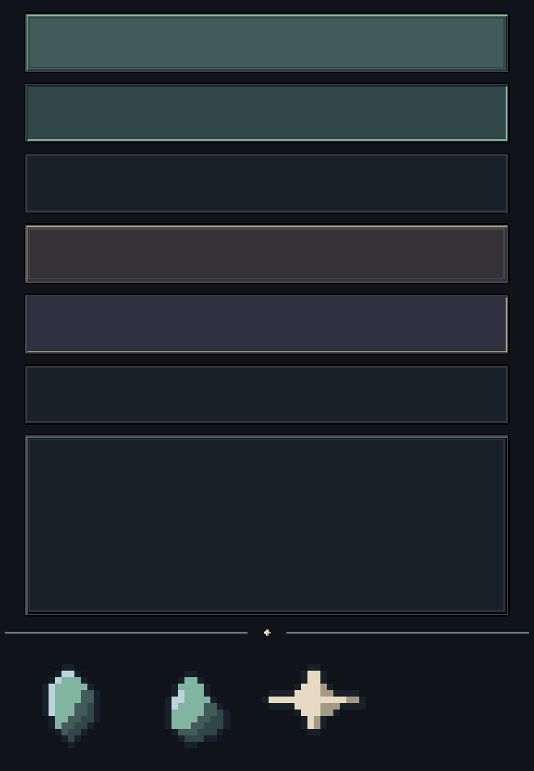

# ui_kit — candidato v001

**Status:** `CANDIDATO`, sem aprovação. Gerado por [`tools/art/build_ui_kit.py`](../../../../tools/art/build_ui_kit.py) (pixel art desenhado por script, sem IA e sem ComfyUI), reproduzível com `python tools/art/build_ui_kit.py`. Contrato: [`ui_kit.yaml`](../../contracts/screens/ui_kit.yaml). Fica fora de `assets/` de propósito: só entra no jogo depois da auditoria visual independente e do QA técnico.

## Peças

| Arquivo | Tamanho | Uso |
| --- | --- | --- |
| `button_primary_{normal,pressed,disabled}.png` | 48×48, 9-slice com margem de 6 px | ação principal |
| `button_secondary_{normal,pressed,disabled}.png` | 48×48, 9-slice com margem de 6 px | ação secundária |
| `panel_frame.png` | 48×48, 9-slice com margem de 6 px | painéis opacos |
| `divider.png` | 432×8 | separador de listas |
| `icon_fragment.png`, `icon_residue.png`, `icon_xp.png` | 16×16 | recursos |

Paleta: TY40, subconjuntos `neutral_stone` e `lumen`, no máximo 5 cores por peça (limite do contrato: 16). Alpha binário. Luz no canto superior esquerdo. O script confere tamanho, alpha e paleta a cada execução.

## Decisões de desenho

- Estado nunca só por cor: pressionado inverte o bisel, desabilitado perde o bisel e escurece, e o texto da UI diz o motivo (ver [SCREEN_CONVENTIONS](../../../09_ui/SCREEN_CONVENTIONS.md)). O desabilitado é o mesmo nos dois tipos de botão.
- Primário em verde-azulado de Lúmen; secundário em pedra neutra.
- Wood ficou de fora deste candidato: nenhum estado o exige ainda.

## Problemas conhecidos (para a auditoria)

- Os ícones de Fragmento e de Resíduo se parecem: as duas são gemas verde-azuladas e só a silhueta as separa. Provável ajuste: dar ao Fragmento um tom mais claro/azulado, ou ao Resíduo um contorno de gota mais marcado.
- O ícone de XP é uma estrela simples e um pouco rígida.
- O bisel de 1 px é discreto em tela cheia; pode precisar de mais contraste a 1×.
- Os ícones de 24×24 previstos para o resultado (`UI_S07`) não foram gerados.
- Sem manifesto por asset em `docs/art/manifests/` e sem `sprite_lint.py` rodado (o script tem verificação própria de paleta, que não substitui o lint oficial).
- Sem teste de legibilidade a 1× em 432×960 nem no emulador.
