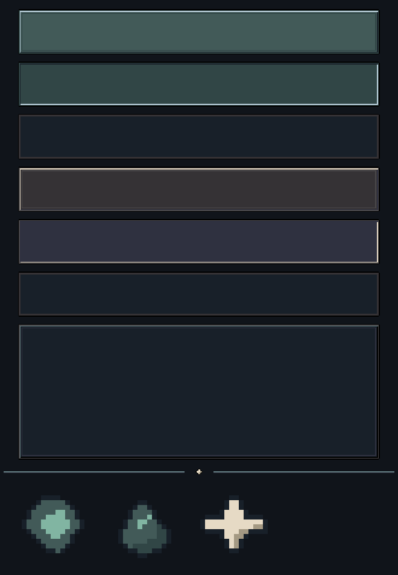

# ui_kit — candidato v002

**Status:** `CANDIDATO`; aguardando revisão artística independente. Gerado por script, sem IA. Os arquivos permanecem fora de `assets/` até o gate passar. Fonte: [`tools/art/build_ui_kit.py --version v002`](../../../../tools/art/build_ui_kit.py); contrato: [`ui_kit.yaml`](../../contracts/screens/ui_kit.yaml).

## Peças

- Botões primário e secundário nos estados normal, pressionado e desabilitado: 48×48, 9-slice com margem de 6 px.
- Moldura opaca de painel: 48×48, 9-slice com margem de 6 px.
- Divisor de lista: 432×8.
- Ícones de Fragmento de Ressonância, Resíduo de Lúmen e XP: cada um em 16×16 e 24×24.

## Direção e revisão

A paleta segue TY40 e os subconjuntos declarados no contrato. O Fragmento foi redesenhado como lasca fosca de Lúmen para não depender da leitura de uma gema brilhante. Estados de botão mudam forma e bisel, não só cor. Os PNGs usam alpha binário.

Manifestos em [`docs/art/manifests/`](../../manifests/). A v002 continua candidata: a auditoria visual independente, a checagem de costuras dos 9-slice em tela real e a validação mobile seguem pendentes. Não copiar para `assets/` antes desses gates.
