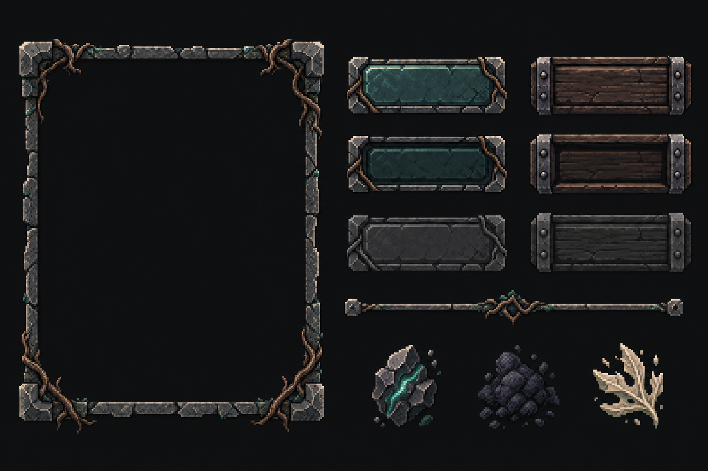

# ui_kit — proposta v003

**Status:** `CONCEPT`; conceito aprovado por Rafael em 2026-09-30. A pixelização, o QA técnico e a auditoria independente continuam pendentes. Esta direção foi reiniciada do zero usando o contrato do `ui_kit`, as convenções de tela, o guia de estilo e a TY40. As versões anteriores não foram usadas como referência visual.

## Conceito

Prancha gerada a partir de descrição textual, sem imagem de entrada. A proposta combina pedra escura irregular, raízes aparentes, madeira ferrada e marcas discretas de Lúmen. A hierarquia vem de forma, material e relevo; sem loja, moeda premium, contadores de oferta ou brilho de recompensa.

## Escopo do kit

O contrato [`ui_kit.yaml`](../../contracts/screens/ui_kit.yaml) continua sendo a autoridade: botões primário/secundário em três estados e moldura 9-slice de 48×48; divisor 432×8; ícones de Fragmento, Resíduo e XP em 16×16 e 24×24. As peças PNG e a prévia nesta pasta são uma tradução procedural inicial para estudo, não estão aprovadas nem prontas para integração. A margem 9-slice usada na prévia é 8 px.

A exploração procedural foi gerada por um script excluído em 2026-09-30 (arte final deve vir do ComfyUI/Aseprite); o histórico está no git.

## Próximo gate

Revisar e aprovar ou rejeitar o conceito. Após aprovação, ajustar a pixelização e rodar o QA técnico; auditoria artística independente e QA mobile continuam pendentes. O autor não marca a própria arte como aprovada.
